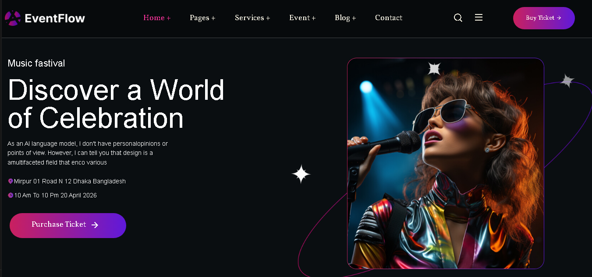
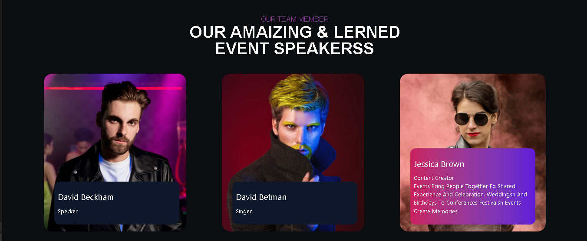
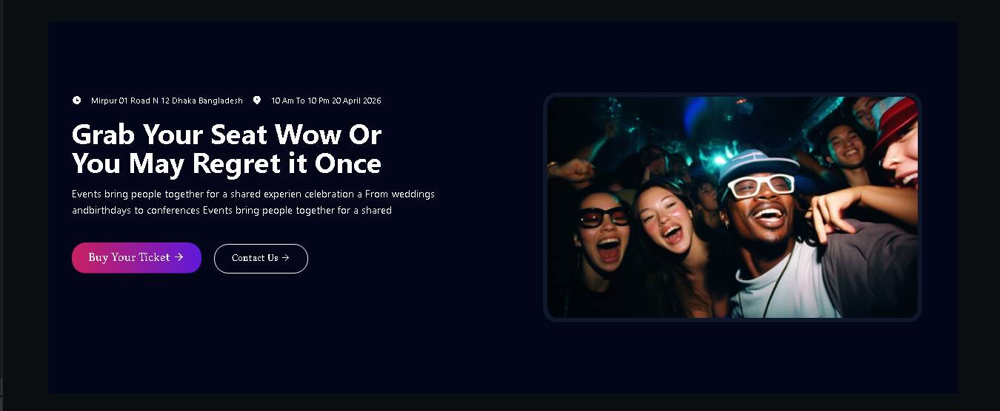

<div align="center">

# EventFlow — Tailwind CSS Template

**A modern, responsive Event & Conference landing page**
built with **Tailwind CSS v4** · Pixel-perfect recreation of the original EventFlow design

<br/>

[](https://developer.mozilla.org/en-US/docs/Web/HTML)
[](https://developer.mozilla.org/en-US/docs/Web/CSS)
[](https://tailwindcss.com/)
[](LICENSE)

</div>

---

## ✨ Preview

<div align="center">
<br/>







<br/>
</div>

---

## 🚀 Live Demo

<div align="center">

<br/>

<a href="https://arshiya7-dev.github.io/eventflow-tailwind/" target="_blank">
  
</a>

<br/><br/>

</div>

---

## 📌 About The Project

**EventFlow** is a sleek and fully responsive **Event & Conference** landing page template, rebuilt from scratch using **Tailwind CSS v4**. Inspired by the original EventFlow design on ThemeForest, this project demonstrates a professional-grade static site with modern utility-first CSS — no frameworks, no bloat.

Perfect for:
- 🎤 Conferences & Summits
- 🎪 Meetups & Exhibitions
- 🏛️ Seminars & Business Events
- 🎵 Concerts & Festivals

---

## 🎯 Features

- ✅ **Tailwind CSS v4** — utility-first, zero-config build
- ✅ **Fully Responsive** — mobile, tablet, and desktop ready
- ✅ **Modern Hero Section** with gradient overlay
- ✅ **Speakers & Schedule Section** with clean card layouts
- ✅ **Sponsors Grid** with hover effects
- ✅ **Smooth Navigation** with sticky header
- ✅ **Custom Fonts** via local font assets
- ✅ **Optimized Output CSS** — production-ready stylesheet

---

## 📁 Project Structure

```
eventflow-tailwind/
│
├── node_modules/               # Node.js dependencies
│
├── src/
│   ├── index.html              # Main HTML file
│   │
│   └── asset/
│       ├── font/               # Custom web fonts
│       ├── image/              # Project images & icons
│       ├── S/                  # Screenshots
│       │   ├── s1.png
│       │   ├── s2.png
│       │   └── s3.png
│       └── stylesheet/
│           ├── master.css      # Source Tailwind CSS (input)
│           └── output.css      # Compiled CSS (output)
│
├── package.json                # Project metadata & scripts
└── package-lock.json
```

---

## 🙌 Acknowledgements

- Original design inspiration: [EventFlow on ThemeForest](https://themeforest.net/item/eventflow-event-conference-meetup-management-django-template/63492551)
- [Tailwind CSS](https://tailwindcss.com/) for the amazing utility-first framework
- All icon and image assets used are for demonstration purposes

---

<div align="center">

Made with ❤️ by **[Arshiya](https://github.com/arshiya7-dev)**

⭐ Star this repo if you found it helpful!

</div>
